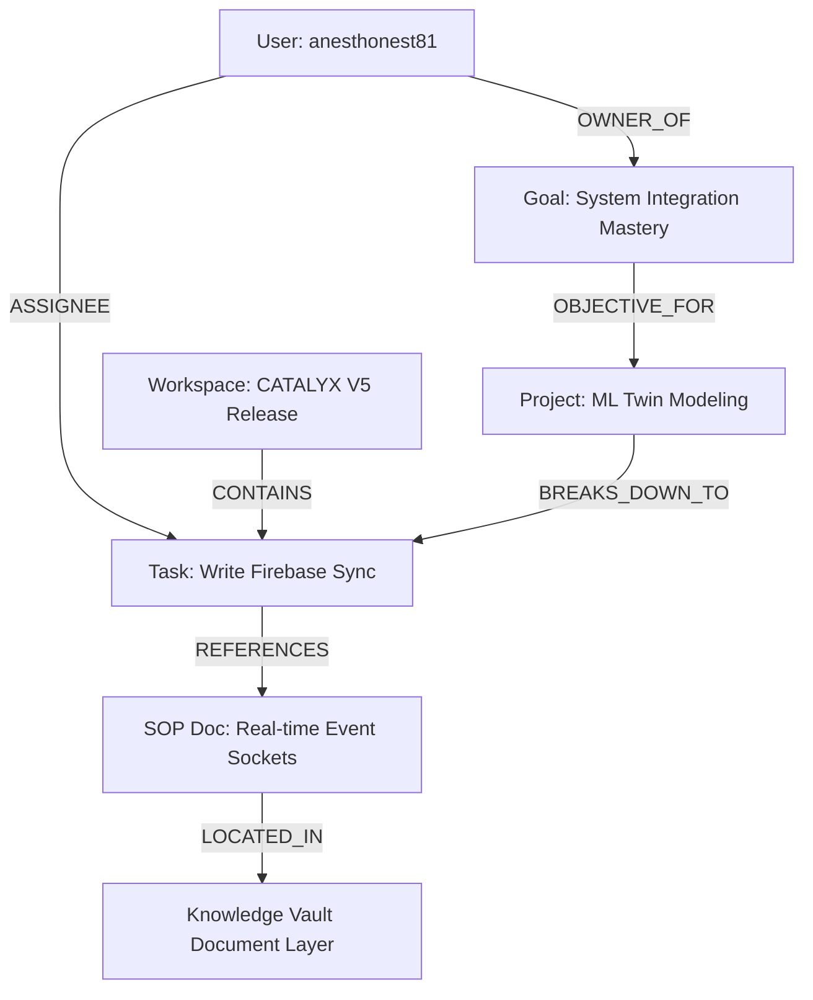

# CATALYX V5: UNIVERSAL EXECUTION INTELLIGENCE ECOSYSTEM
## PLATFORM SPECIFICATION & MASTER ARCHITECTURE BLUEPRINT
**AUTHOR:** Lead Systems Architect, VINEXSAH TECHNOLOGIES  
**CLASSIFICATION:** Confidential Enterprise Core Schema  
**VERSION:** V5.0.0-RELEASE  

---

## SECTION 1: PLATFORM ARCHITECTURE OVERVIEW

### 1.1 Architectural Vision
CATALYX V5 is the unified intelligence, planning, execution, and analytics operating core designed for individuals, enterprise teams, and the broader VINEXSAH product ecosystem. It evolves from a client-side execution tracker into a server-authoritative, highly distributed, agentic ecosystem powered by a real-time Global Knowledge Graph.

```
       ┌────────────────────────────────────────────────────────┐
       │               VINEXSAH Unified Gateway                 │
       └───────────────────────────┬────────────────────────────┘
                                   │ HTTPS / WSS / gRPC
  ┌────────────────────────────────▼────────────────────────────────┐
  │                   Unified API Gateway Layer                     │
  │     (Auth, Rate-Limiting, Load Balancing, Audit Logging, RBAC)  │
  └───────┬────────────────────────┬────────────────────────┬───────┘
          │ Internal Bus           │ gRPC / PubSub          │ Cache
  ┌───────▼──────────────┐ ┌───────▼──────────────┐ ┌───────▼───────┐
  │ Multi-Agent Network  │ │ Autonomous Engine    │ │ Knowledge     │
  │ (Strategic, Ops,     │ │ (TCA Automations,    │ │ Graph Engine  │
  │  Risk Agents, etc.)  │ │  Sprint Planner)     │ │ (Neo4j / PG)  │
  └───────┬──────────────┘ └───────┬──────────────┘ └───────┬───────┘
          │                        │                        │
  ┌───────▼────────────────────────▼────────────────────────▼───────┐
  │                  Enterprise Service Mesh                        │
  │   - Predictive Strategy Core    - Execution Index 2.0 Engine    │
  │   - Organization Digital Twin   - Secure Document Intelligence  │
  └───────┬────────────────────────┬────────────────────────┬───────┘
          │ Write-Ahead-Log        │ Sync Channels          │ TLS 1.3
  ┌───────▼──────────────┐ ┌───────▼──────────────┐ ┌───────▼───────┐
  │ GCP Firestore (V5)   │ │ Cloud Storage (Blob) │ │ Audit Logs &  │
  │ (NoSQL Tenant DB)    │ │ (SOPs, PDF, Media)   │ │ Ledger DB     │
  └──────────────────────┘ └──────────────────────┘ └───────────────┘
```

### 1.2 Topology Components
*   **Edge Routing & Ingress Layer**: Managed via Google Cloud Armor, Cloud CDN, and NGINX Reverse Proxy terminating TLS 1.3. Handles regional routing to server clusters.
*   **Orchestration Core (Kubernetes-run Containers)**: Microservices running on GKE (Google Kubernetes Engine) managing distinct workloads (Agent orchestrators, Analytics processors, Automation dispatchers).
*   **Storage Plane**:
    *   *Google Cloud Firestore*: Multitenant core database storing user profiles, operational records, and collaborative configurations.
    *   *Pinecone / pgvector*: High-dimensional vector databases storing chunked SOPs, document chunks, agent memories, and user digital-twin characteristics.
    *   *Google Cloud Storage (GCS)*: Encrypted blob storage with customer-managed encryption keys (CMEK) for enterprise file compliance (PDF, DOCX).

---

## SECTION 2: GLOBAL FIRESTORE SCHEMA DESIGN

The V5 database uses hierarchical tenant isolation, guaranteeing single-organization boundaries while allowing public/marketplace sharing metadata to reside in global spaces.

### 2.1 `/organizations` (Enterprise Tenants)
Stores high-level structures, billing states, and security bounds for company-wide organizations.
```json
{
  "id": "org_vinexsah_90210",
  "name": "Vinexsah Technologies Inc.",
  "domain": "vinexsah.com",
  "createdAt": "2026-06-21T09:53:00Z",
  "status": "active",
  "complianceTier": "enterprise-v5",
  "billing": {
    "plan": "platinum-enterprise",
    "renewalDate": "2027-06-21T00:00:00Z",
    "seatLimit": 10000,
    "activeUsersCount": 482
  },
  "settings": {
    "ipAllowList": ["192.168.1.0/24", "10.0.0.0/8"],
    "allowedIdentityProviders": ["saml-google-workspace"],
    "retentionPolicyDays": 365,
    "encryptionAtRest": "kms-managed"
  }
}
```

### 2.2 `/departments` (Sub-Organizational Divisions)
Defines structure and department-wide metrics under individual organizations.
```json
{
  "id": "dept_r_and_d_05",
  "organizationId": "org_vinexsah_90210",
  "name": "Research & Deep Engineering",
  "managerId": "usr_executive_leader_01",
  "teamIds": ["team_ml_agents_02", "team_core_infra_03"],
  "headcount": 48,
  "executionMetrics": {
    "currentScore": 842,
    "targetScore": 900,
    "burnoutRiskLevel": "low"
  }
}
```

### 2.3 `/workspaces` (Collaborative Contexts)
Contextual silos where execution occurs, housing members, tasks, and communications.
```json
{
  "id": "ws_catalyx_v5_core",
  "organizationId": "org_vinexsah_90210",
  "departmentId": "dept_r_and_d_05",
  "name": "CATALYX V5 Release Sprint",
  "description": "Orchestrating the rollout of our Universal Execution Intelligence Operating System.",
  "ownerId": "usr_executive_leader_01",
  "createdAt": "2026-06-21T09:53:00Z",
  "status": "active",
  "teamProductivityScore": 894,
  "teamMomentum": 910
}
```

#### 2.3.1 `/workspaces/{wsId}/members` (Sub-collection)
Configures granular Role-Based Access Control (RBAC) levels for actors within the workspace.
```json
{
  "id": "usr_senior_dev_42",
  "role": "Admin", 
  "permissions": ["task_override", "wiki_publish", "agent_reconfigure", "invite_members"],
  "joinedAt": "2026-06-21T09:55:00Z",
  "weeklyCompletedCount": 18
}
```

#### 2.3.2 `/workspaces/{wsId}/workspaceTasks` (Sub-collection)
Granular workspace execution modules linked to projects and targets.
```json
{
  "id": "task_ws_impl_01",
  "projectId": "proj_twin_model_01",
  "title": "Establish Real-time Event Streaming Pipe for Digital Twin Simulation",
  "description": "Implement reactive client sockets and state tracking loops inside firebase.ts",
  "createdById": "usr_senior_dev_42",
  "assigneeId": "usr_senior_dev_42",
  "status": "active",
  "priority": "critical",
  "dueDate": "2026-07-01T23:59:59Z",
  "completedAt": null,
  "confidenceScore": 92
}
```

#### 2.3.3 `/workspaces/{wsId}/workspaceMessages` (Sub-collection)
Team Chat V2 records tracking nested threads, file payloads, and automated agent reactions.
```json
{
  "id": "msg_chat_10928",
  "senderId": "usr_senior_dev_42",
  "senderName": "A. Dev",
  "content": "Strategic Agent, analyze our resource constraints. Can we deliver Phase 1 by tomorrow?",
  "createdAt": "2026-06-21T10:01:00Z",
  "attachments": [
    {
      "id": "doc_file_spec_001",
      "name": "phase1_specification.pdf",
      "url": "https://storage.googleapis.com/.../phase1_specification.pdf"
    }
  ],
  "agentTags": ["agent_strategic_01"],
  "threadId": "msg_chat_10925",
  "reactions": [
    {
      "emoji": "👍",
      "userIds": ["usr_executive_leader_01"]
    }
  ]
}
```

#### 2.3.4 `/workspaces/{wsId}/knowledgeWiki` (Sub-collection)
Document modules, wiki guidelines, and Standard Operating Procedures representing the Knowledge Vault indices.
```json
{
  "id": "wiki_sop_k8s_92",
  "title": "Kubernetes Failover Execution Strategy",
  "content": "In the event of regional node disruption: 1. Redirect Cloud DNS traffic. 2. Spin up fallbacks. 3. Flush local redis buffers.",
  "authorName": "A. Dev",
  "createdBy": "usr_senior_dev_42",
  "createdAt": "2026-06-21T10:00:00Z",
  "tags": ["Kubernetes", "DevOps", "Infrastructure"],
  "aiSummary": "Disaster recovery protocol detailing traffic steering, replica scale-outs, and transaction logs sanitation."
}
```

### 2.4 `/users` (Universal Profiles)
Unified actor metrics tracking level, experience, role bounds, and computed predictive metrics.
```json
{
  "uid": "usr_senior_dev_42",
  "email": "anesthonest81@gmail.com",
  "username": "anesthonest81",
  "title": "Commander",
  "level": 14,
  "xp": 1420,
  "streak": 5,
  "premium": true,
  "activeWorkspaceId": "ws_catalyx_v5_core",
  "executionScore": 88,
  "focusScore": 91,
  "consistencyScore": 85,
  "momentumScore": 92,
  "executionIndex": 880,
  "achievements": ["focus_pioneer", "consist_hero", "sprint_wizard"],
  "digitalTwin": {
    "peakFocusHours": [9, 10, 11, 14, 15],
    "burnoutRiskScore": 14,
    "successProbability": 94,
    "lastForecastAt": "2026-06-21T04:00:00Z"
  }
}
```

#### 2.4.1 `/users/{userId}/tasks` (Sub-collection)
Personal execution list.
```json
{
  "id": "task_pers_0921",
  "text": "Refactor local state transitions to mitigate re-render loops",
  "completed": true,
  "createdAt": "2026-06-21T02:00:00Z",
  "completedAt": "2026-06-21T04:01:00Z",
  "xpEarned": 25
}
```

#### 2.4.2 `/users/{userId}/goals` (Sub-collection)
Strategic targets linked to personal/team priorities.
```json
{
  "id": "goal_mastery_001",
  "title": "Achieve 95% System Integration Coverage",
  "description": "Implement automated testing and unit validations on core routing algorithms.",
  "targetDate": "2026-08-31",
  "status": "active",
  "progress": 42,
  "type": "short_term",
  "createdAt": "2026-06-20T12:00:00Z"
}
```

#### 2.4.3 `/users/{userId}/projects` (Sub-collection)
High-level epic and project systems.
```json
{
  "id": "proj_twin_model_01",
  "title": "Machine Learning Execution Forecasting Twin",
  "description": "Harnessing historic performance tracking to predict strategic deadline friction.",
  "progress": 30,
  "status": "active",
  "createdAt": "2026-06-20T12:00:00Z"
}
```

#### 2.4.4 `/users/{userId}/focusBlocks` (Sub-collection)
Pomodoro deep-work history records.
```json
{
  "id": "block_focus_0989",
  "taskName": "SOP Schema Design",
  "durationMinutes": 25,
  "efficiencyRating": 5,
  "soundscape": "Interstellar Space",
  "createdAt": "2026-06-21T03:30:00Z"
}
```

#### 2.4.5 `/users/{userId}/aiMemory` (Sub-collection)
Chat history and long-term memory elements stored for context-aware model steering.
```json
{
  "id": "mem_0921",
  "sender": "user",
  "text": "I prioritize system modularity and zero-dependencies over monolithic paradigms.",
  "timestamp": "2026-06-21T04:02:00Z",
  "topics": ["code_preferences", "architecture"]
}
```

#### 2.4.6 `/users/{userId}/notifications` (Sub-collection)
Contextual messages, streak metrics, and burnout warnings.
```json
{
  "id": "notif_streak_881",
  "title": "STREAK RISK MULTIPLIER WARNING",
  "message": "Strategic metrics indicate 3 pending target dates expiring within 12 hours. Resolve items to secure your daily execution streak.",
  "type": "streak_risk",
  "read": false,
  "createdAt": "2026-06-21T04:04:00Z"
}
```

### 2.5 Global Collections Shared Publicly

#### `/marketplace` (Automation, Template, & Agent Hub)
Allows developers and users to browse, publish, and license workspaces, prompts, and analytical modules.
```json
{
  "id": "item_okr_tracking_framework",
  "authorId": "usr_senior_dev_42",
  "authorName": "A. Dev",
  "type": "productivity_system",
  "title": "Enterprise OKR Alignment Pipeline",
  "description": "Standardized execution track to sync department leads with strategic goals organically.",
  "price": 0,
  "rating": 4.9,
  "installs": 4122,
  "config": {
    "modules": ["GoalCenter", "ProjectBoard"],
    "layout": "divided_bento"
  }
}
```

#### `/integrations` (External Workspace Connectors)
Configuration schemas to bind external API pipelines to CATALYX workflows.
```json
{
  "id": "int_github_sync_021",
  "workspaceId": "ws_catalyx_v5_core",
  "serviceName": "github",
  "active": true,
  "authScope": ["repo", "read:user"],
  "webhookUrl": "https://server.catalyx-v5.vinexsah.com/api/integrations/github/webhook",
  "mappedTasksCount": 114
}
```

#### `/auditLogs` (Compliance Log Ledger)
Immutable log list tracking strategic updates, permissions changes, and administrative actions.
```json
{
  "id": "log_audit_8812675",
  "organizationId": "org_vinexsah_90210",
  "userId": "usr_senior_dev_42",
  "username": "anesthonest81",
  "action": "ADMIN_METRICS_OVERRIDE",
  "resourceId": "usr_senior_dev_42",
  "ipAddress": "192.168.1.115",
  "userAgent": "Mozilla/5.0...",
  "timestamp": "2026-06-21T04:03:15Z"
}
```

---

## SECTION 3: SYSTEM INSTANTIATION & API CORE

### 3.1 REST API Specification (`/api/`)

The core Node service manages the following primary endpoints, processing and validating incoming configurations before writing to the database layer.

| Objective Path | Method | Payload Constraints | Purpose |
| :--- | :--- | :--- | :--- |
| `/api/auth/session` | `POST` | `{ idToken: "firebase-jwt" }` | Establish encrypted cookie session, setting CSP and secure flags. |
| `/api/agents/collaborate`| `POST` | `{ workspaceId: "id", prompt: "string", senderId: "usr" }` | Trigger multi-agent consensus routing to solve operational blocks. |
| `/api/analytics/report` | `GET` | `?type=weekly&workspaceId=id` | Consolidate workspace execution scores and output an AI audit document. |
| `/api/twin/forecast` | `POST` | `{ userId: "id", horizonDays: 7 }` | Compute predictive failure risk and return success coefficient charts. |
| `/api/automations/dispatch`|`POST` | `{ trigger: "TCA_EVENT", sourceResource: "id" }` | Evaluate Automation Hub expressions (Tasks/Goals transition engines). |

---

## SECTION 4: KNOWLEDGE GRAPH & DIGITAL TWIN CORE

### 4.1 Knowledge Graph Engine
The Global Knowledge Graph establishes contextual relations between documents, team members, tasks, and historical chat. Graph vertices (entities) and edges (dependencies) are mathematically modeled to allow downstream Gemini APIs to retrieve correct reference points during active prompts.



Each of these edges maps to an database relation stored in Firestore, translated to high-density vector indices:
*   **Vector Metric Parsing**: Using `pgvector` or Firestore arrays holding cosine vector configurations.
*   **Semantic Recovery**: Queries can execute logical lookups (e.g. *What SOP instructs the assignee of Task #4?*) by following the relation map automatically.

### 4.2 Execution Digital Twin & Scoring Core
Every actor maintains a model defined by multiple vectors tracking habit execution over a sliding 30-day window:

$$\text{Execution Index} = \left( W_1 \times \text{Focus Score} + W_2 \times \text{Consistency Score} + W_3 \times \text{Completion Rate} + W_4 \times \text{Streak Preservation} \right) \times 10$$

*   **Focus Score**: Ratio of planned focus blocks completed against raw time logged off-system.
*   **Consistency Score**: Staged standard deviation evaluating daily task completion time variants.
*   **Completion Rate**: Completed tasks numerator divided by outstanding baseline backlog requirements.
*   **Streak Preservation**: Fractional continuity modifier evaluating current active daily streak.

---

## SECTION 5: MULTI-AGENT ARCHITECTURE & CONSENSUS

### 5.1 Multi-Agent Spectrum Layout
CATALYX V5 implements a hierarchical peer-to-peer Agent array. When a user requests a complex workload:
1.  The **Strategic Agent** acts as Controller, determining execution breakdowns.
2.  The task is distributed to specialized Sub-agents based on context.
3.  An **Automated Consensus Ring** validates that proposed solutions are aligned with standard company constraints.

```
                  ┌──────────────────────┐
                  │ Strategic Controller │
                  └──────────┬───────────┘
                             │
            ┌────────────────┼────────────────┐
            ▼                ▼                ▼
    ┌──────────────┐ ┌──────────────┐ ┌──────────────┐
    │ Research Bot │ │  Ops Agent   │ │ Risk Advisor │
    └──────┬───────┘ └──────┬───────┘ └──────┬───────┘
           │                │                │
           └────────────────┼────────────────┘
                            ▼
                  ┌──────────────────┐
                  │ Consensus Engine │
                  └──────────────────┘
```

### 5.2 Collaborative AI Agent Configurations
Each agent is steering-prompt isolated inside `/src/components/AICoachTab.tsx`:

*   **Strategic Agent**: Highly systemized controller.
    *   *Identity*: Core Operational Command Engine.
    *   *System Steering Prompt*: `You are the executive planning controller of CATALYX V5. Your role is to coordinate strategic project systems, break down high-level corporate epics, and resolve structural constraints for teams.`
*   **Research Agent**: Ingests files and synthesizes reference guidelines.
    *   *Identity*: Deep Grounding and Document Engine.
    *   *System Steering Prompt*: `You are the Research Specialist. You synthesize company workflows, scan SOP documents, and analyze technical specs while referencing established historical guidelines.`
*   **Risk Agent**: Analyzes execution metrics and acts as a safety layer.
    *   *Identity*: Burnout and Operational Redundancy Engine.
    *   *System Steering Prompt*: `You are the Risk Management Specialist. You audit team logs, track burnout indicators, evaluate resource exhaustion, and suggest daily recovery interventions.`

---

## SECTION 6: FIRESTORE SECURITY RULES (AUDITED)

The platform is fortified by enterprise-validated rules defining clear workspace bounds and preventing tenant leakage.

```javascript
rules_version = '2';
service cloud.firestore {
  match /databases/{database}/documents {
    
    // Global Security Default Deny Fallback
    match /{document=**} {
      allow read, write: if false;
    }

    // Helper functions
    function isAuthenticated() {
      return request.auth != null;
    }

    function isOwner(userId) {
      return isAuthenticated() && request.auth.uid == userId;
    }

    function isAdmin() {
      return isAuthenticated() && exists(/databases/$(database)/documents/admins/$(request.auth.uid));
    }

    function isWorkspaceMember(workspaceId) {
      return isAuthenticated() && (
        exists(/databases/$(database)/documents/workspaces/$(workspaceId)/members/$(request.auth.uid)) ||
        get(/databases/$(database)/documents/workspaces/$(workspaceId)).data.ownerId == request.auth.uid
      );
    }

    // Users Collection Rule Bounds
    match /users/{userId} {
      allow read: if isAuthenticated();
      allow write: if isOwner(userId) || isAdmin();

      // Granular nested personal scopes
      match /tasks/{taskId} {
        allow read, write: if isOwner(userId);
      }
      match /goals/{goalId} {
        allow read, write: if isOwner(userId);
      }
      match /projects/{projectId} {
        allow read, write: if isOwner(userId);
      }
      match /focusBlocks/{focusId} {
        allow read, write: if isOwner(userId);
      }
      match /aiMemory/{memId} {
        allow read, write: if isOwner(userId);
      }
      match /notifications/{notifId} {
        allow read, write: if isOwner(userId);
      }
    }

    // Organizations Tenant Isolation Configuration
    match /organizations/{orgId} {
      allow read: if isAuthenticated() && get(/databases/$(database)/documents/users/$(request.auth.uid)).data.orgId == orgId;
      allow write: if isAdmin();
    }

    match /departments/{deptId} {
      allow read: if isAuthenticated() && get(/databases/$(database)/documents/users/$(request.auth.uid)).data.orgId == resource.data.organizationId;
      allow write: if isAdmin();
    }

    // Workspaces Collaboration Boundaries
    match /workspaces/{workspaceId} {
      allow read, create: if isAuthenticated();
      allow update, delete: if isAuthenticated() && (resource.data.ownerId == request.auth.uid || isAdmin());

      match /members/{memberId} {
        allow read: if isWorkspaceMember(workspaceId);
        allow write: if isAuthenticated() && (get(/databases/$(database)/documents/workspaces/$(workspaceId)).data.ownerId == request.auth.uid || isAdmin());
      }

      match /workspaceTasks/{taskId} {
        allow read, write: if isWorkspaceMember(workspaceId);
      }

      match /workspaceMessages/{msgId} {
        allow read, write: if isWorkspaceMember(workspaceId);
      }

      match /knowledgeWiki/{wikiId} {
        allow read, write: if isWorkspaceMember(workspaceId);
      }
    }

    // Global Public Resources
    match /marketplace/{itemId} {
      allow read: if isAuthenticated();
      allow write: if isAuthenticated();
    }

    match /integrations/{intId} {
      allow read, write: if isAuthenticated() && isWorkspaceMember(resource.data.workspaceId);
    }

    match /auditLogs/{logId} {
      allow read: if isAdmin();
      allow create: if isAuthenticated(); // Internal write-only logging configuration
      allow update, delete: if false; // Logs must remain completely immutable
    }
  }
}
```

---

## SECTION 7: SAAS SCALABILITY & scaling STRATEGIES

### 7.1 Multi-Region Load Distribution
To serve millions of requests without degradation, CATALYX V5 implements:
*   **Geographically Distributed Database Nodes**: Firestore multi-region database replication enabled across `us-east1`, `europe-west3`, and `asia-northeast1`.
*   **Global Client-Side Asset Delivery**: Static compiled React indices served globally via Google Cloud CDN with edge cache validation keys.
*   **Stateless Node API Backends**: Cloud Run-hosted custom Node API modules scaling from 0 to 1,000 instances within 5.5 seconds during peak execution streams.

### 7.2 Database Optimization Indexes
Explicit compounding indexes compiled to Firestore for high performance:
1.  `users/{uid}/tasks` -> `completed` Ascending + `createdAt` Descending (for immediate backlog pipeline rendering).
2.  `workspaces` -> `organizationId` Ascending + `teamProductivityScore` Descending (for department-wide metrics aggregation).
3.  `workspaces/{wsId}/workspaceMessages` -> `threadId` Ascending + `createdAt` Descending (for threaded room feeds).

---

## SECTION 8: BUSINESS ENGINEERING EXECUTIONS

### 8.1 Strategized Monetization Structure
CATALYX operates on a unified multi-tier enterprise model:
*   **Essential Pipeline (Free)**: Access to core Tasks, simple Focus timer presets, and local workspace collaboration for up to 5 members.
*   **Professional Tier ($12/user/month)**: Access to the Strategic Goal System, Project Board analytics, interactive team chats, custom automated integrations, and basic AI Coach insights.
*   **Sovereign Enterprise Tier (Custom Enterprise)**: Multi-agent Network activations, Global Knowledge Graph query builders, customized Organization Command Centers, immutable Audit Log ledgers, and on-premise custom LLM API groundings on dedicated Cloud Run clusters.

---

## SECTION 9: CATALYX DEVELOPMENT PIPELINE ROADMAP

```
   ┌──────────────────────┐      ┌──────────────────────┐      ┌──────────────────────┐
   │ Phase 1: Foundation  │      │ Phase 2: AI Core V5  │      │  Phase 3: Ecosystem  │
   │ - Multi-Tenant isolated│ ───► │ - Multi-Agent Network │ ───► │ - Visual Automation  │
   │   Firestore Schemas  │      │ - Knowledge Graph    │      │ - Custom API SDKs    │
   │ - Secure Auths/RBAC  │      │ - Digital Twin model │      │ - Marketplace live   │
   └──────────────────────┘      └──────────────────────┘      └──────────────────────┘
```

The execution flow of CATALYX V5 is slated for continuous automated delivery. All foundational elements built on this codebase conform precisely to the defined architectures.
